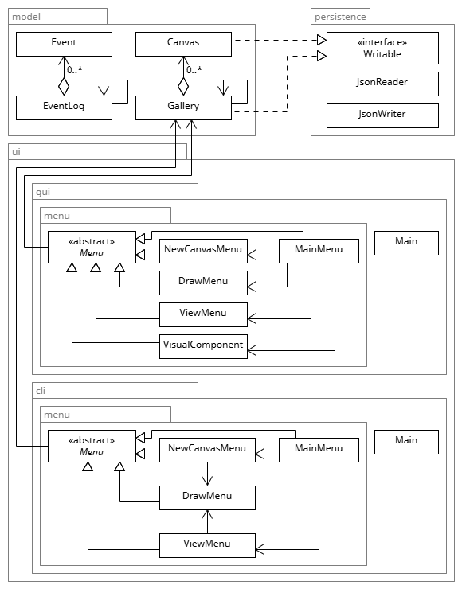

# Etch A Sketch

## What the application does?

The application is a digital version of the drawing toy [Etch A Sketch](https://en.wikipedia.org/wiki/Etch_A_Sketch). An Etch A Sketch consists of three components: two knobs, a canvas, and a stylus. The left knob moves the stylus left and right, while the right knob moves it up and down, depending on which way you **twist** them. The white canvas displays what you draw, you can draw with a black stylus.

The functionality of the stylus makes the Etch A Sketch unique from other drawing toys. First, the stylus cannot be lifted, your entire drawing is a single continuous line. However, the stylus can be moved in all 2D directions. Second, once you have advanced the stylus, you can not undo the change. When you're done with your drawing and want to restart, you can shake the canvas to get a blank canvas.

The **digital** version is like the physical toy but better, because it has **extra** features. For example, allowing you to make as many drawings as you want with no need to erase your drawing every time. It also allows you to see all your saved drawings.

## Instructions for End User

- **How to add an canvas to gallery**
    1. In main menu, click 'New Canvas'
    2. Enter desired width and height 
    3. Click 'Create Canvas'
- **How to draw on canvas**
    1. Following the same steps above of 'how to add a canvas to gallery' 
    2. You are now in the drawing menu
    3. To move the stylus and start drawing use the arrow keys (Default controls)
    4. If you do not like the controls, in the top left corner there is a remap controls menu bar
    5. Click the direction you would like to remap, then click the new key
- **How to view canvases**
    1. In main menu, click 'View Canvas'
    2. In the bottom, you can either go to the next or previous Canvas by clicking the buttons
- **How to export canvas to PNG**
    1. In main menu, click 'View Canvas'
    2. Navigate to canvas you would like to export next Canvas and the previous Canvas buttons
    3. At the top, click 'Export to .png' to export
    4. Image will be in data folder
- **How to draw on old canvas**
    1. In main menu, click 'View Canvas'
    2. Navigate to canvas you would like to export next Canvas and the previous Canvas buttons
    3. At the bottom, click 'Draw'
- **How to find the visual component (game)**
    1. In main menu, click 'Visual Component'
    2. You will see an image in the middle of the frame
    - Credit to: https://github.com/djaiss/mapsicon for the 512x512 images
- **How to save your gallery**
    1. In main menu, click 'Save Gallery'
- **How to load your gallery**
    1. In main menu, click 'Load Gallery'

## UML

Omitted:
- dependency arrows
- all classes not in main package
- methods/fields/inner classes in your class/interface boxes